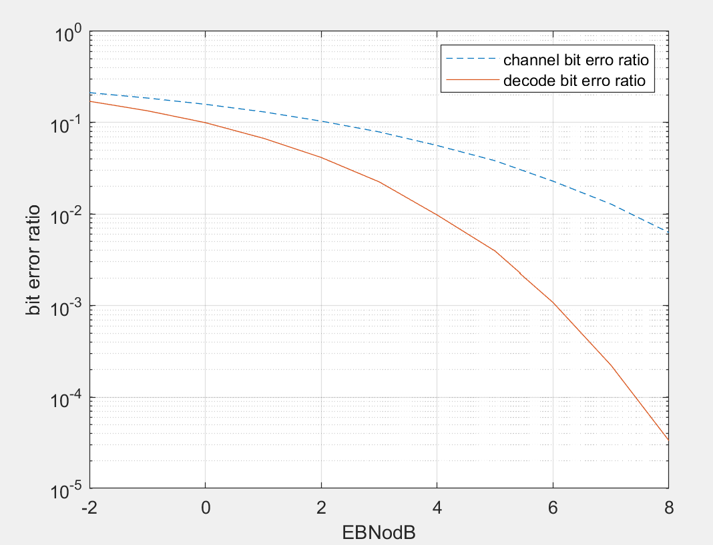

# Performance analyse: LDPC decoder
To verify the performance of LDPC decoder, tne Mont Carlo experiment has been made. 

## 1. SISO min-sum message passing decoder for LDPC 
In general, the parity check matrix is biger the performance of decoder is better.To verify whether the implemented decoder has the ability to correct errors, we made a simple Matrix to verify the LDPC decoder in this case. 
### 1.1 simple verification
the general matrix:  
``` matlab
G = [1 0 0 1 0 1;
     0 1 0 1 1 0;
     0 0 1 0 1 1];
```

The parity check matrix:  
``` matlab
H = [1 1 0 1 0 0;
     0 1 1 0 1 0;
     1 0 1 0 0 1];
```

in each EbNodB, the experiment will excute 100000 times. the result of experiment is as follows  

  

Compared to an uncoded bit sequence, The BER of the decoded bit sequence has been significantly reduced

